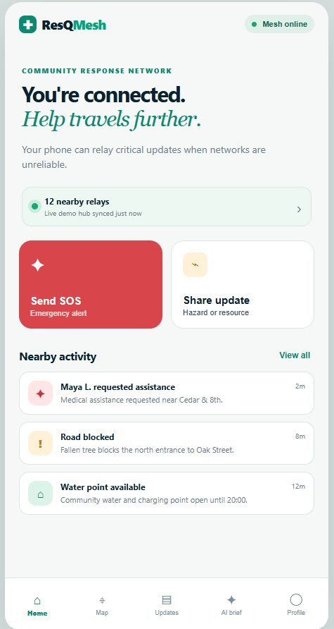
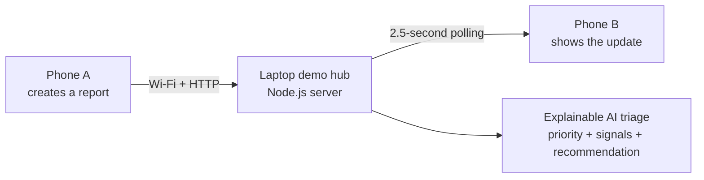
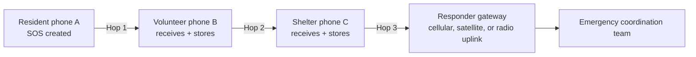
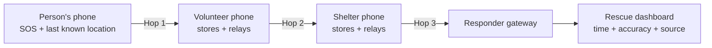
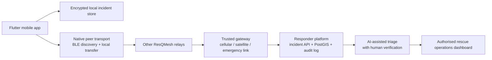

# ResQMesh

**An offline-first, community incident-coordination concept for the first hours of a disaster.**  

> Hackathon prototype only. It is not an emergency service and must not be used for a live disaster until it has undergone security, field, accessibility, and operational validation.



## Table of contents

- **1. [Problem statement — why ResQMesh is needed](#1-problem-statement--why-resqmesh-is-needed)**
  - 1.1. [Nepal flood scenario](#11-nepal-flood-scenario)
  - 1.2. [Communication and information gaps](#12-communication-and-information-gaps)
- **2. [Proposed solution](#2-proposed-solution)**
  - 2.1. [Core user journey](#21-core-user-journey)
  - 2.2. [What the hackathon prototype demonstrates](#22-what-the-hackathon-prototype-demonstrates)
  - 2.3. [What the complete solution delivers](#23-what-the-complete-solution-delivers)
- **3. [Mesh networking: peers, hops, and gateways](#3-mesh-networking-peers-hops-and-gateways)**
  - 3.1. [Current prototype path](#31-current-prototype-path)
  - 3.2. [Ideal multi-hop path](#32-ideal-multi-hop-path)
  - 3.3. [How each hop works](#33-how-each-hop-works)
  - 3.4. [When Wi-Fi infrastructure fails](#34-when-wi-fi-infrastructure-fails)
- **4. [Last-known location for search support](#4-last-known-location-for-search-support)**
- **5. [AI-assisted incident triage](#5-ai-assisted-incident-triage)**
- **6. [Prototype vs. production solution](#6-prototype-vs-production-solution)**
- **7. [Technology stack](#7-technology-stack)**
  - 7.1. [Current prototype stack](#71-current-prototype-stack)
  - 7.2. [Recommended production stack](#72-recommended-production-stack)
- **8. [Two-phone hackathon demonstration](#8-two-phone-hackathon-demonstration)**
- **9. [Path to deployment](#9-path-to-deployment)**
  - 9.1. [Hackathon Demo](#91-hackathon-demo)
- **10. [Safety and product boundaries](#10-safety-and-product-boundaries)**

## 1. Problem statement — why ResQMesh is needed

Floods, earthquakes, landslides, and cyclones do more than damage homes and roads: they also destroy the flow of reliable information when it is most needed. People may have phones and vital local knowledge, but no dependable way to coordinate with neighbours, shelters, or responders.

### 1.1. Nepal flood scenario

Imagine monsoon flooding in a low-lying community near the Bagmati River. Debris blocks a bridge approach, a family needs medical assistance, and a school opens as a shelter with water and charging. Cellular service is unreliable. Residents and volunteers need to know:

- Who needs urgent help, and where was their last known position?
- Which roads or bridges are unsafe?
- Where are verified shelters, water points, food, or charging resources?
- Has an SOS been seen and acknowledged?

The scenario is fictional. The challenge is real: after recent flooding in Nepal, search-and-rescue teams have continued looking for missing people amid severely damaged infrastructure. [UNICEF Nepal situation reports](https://www.unicef.org/nepal/reports/nepal-floods-2026-humanitarian-situation-reports)

### 1.2. Communication and information gaps

- Cellular towers can lose power or become congested.
- Internet backhaul and home Wi-Fi routers can fail.
- Official teams receive duplicate, vague, and quickly changing reports.
- Rumours can spread faster than verified updates.
- People cannot easily identify safe routes, available resources, or whether their SOS has been relayed.

## 2. Proposed solution

ResQMesh is an offline-first coordination layer. It turns structured community observations into a shared incident picture, prioritises what needs verification, and is designed to preserve messages across communication outages.

### 2.1. Core user journey

1. A resident creates an **Emergency**, **Hazard**, **Resource**, **Safe Route**, or **Status** update.
2. The app packages the report with a unique ID, time, expiry, and—when the user explicitly enables it—last-known location metadata.
3. Nearby devices relay the package one hop at a time until it reaches an authorised responder or gateway.
4. AI-assisted triage groups and prioritises reports, while a human responder verifies and acts.
5. Acknowledgements, safe-route information, and resource updates can travel back through the same network.

### 2.2. What the hackathon prototype demonstrates

The current app proves the **coordination experience**, not the final disaster-networking layer:

- A mobile-first PWA for SOS, hazards, resources, map markers, and community updates.
- A two-phone live demo on the same Wi-Fi network.
- A lightweight Node.js laptop hub that shares dummy reports between phones.
- Explainable local AI triage showing priority, signals, and a recommended next action.
- An offline-cached application shell and local fallback sample data.

### 2.3. What the complete solution delivers

The intended end-to-end product replaces the laptop hub with a secure, store-and-forward, device-to-device mesh. It uses direct nearby-device links, encrypted local storage, explicit location consent, trusted responder gateways, and human-supervised AI.

## 3. Mesh networking: peers, hops, and gateways

A **peer** is a nearby participating device. A **hop** is one direct transfer between two peers. A **gateway** is a trusted device or site that can connect the local mesh to an emergency coordination platform through any surviving backhaul, such as cellular, satellite, radio, or wired internet.

### 3.1. Current prototype path



This is a local client-server demonstration. The laptop and its reachable Wi-Fi network are required for new reports to travel between devices.

### 3.2. Ideal multi-hop path



For example, a resident without cellular coverage may transfer an SOS to a volunteer 30 metres away. That volunteer later reaches a shelter coordinator, who then reaches a responder gateway. The report arrives through three hops even though the resident never had internet access.

### 3.3. How each hop works

1. **Discover:** nearby phones identify compatible relay peers with minimal identity exposure.
2. **Handshake:** devices establish an authenticated, encrypted local connection.
3. **Compare:** they exchange compact message IDs before transferring full reports.
4. **Transfer:** only missing, authorised, unexpired reports move to the next peer.
5. **Verify and store:** the receiving device validates the packet, stores it locally, and makes it available for a later hop.
6. **Avoid loops:** message IDs, expiry, hop count, and receipts prevent endless forwarding and duplicates.
7. **Deliver:** a gateway forwards the encrypted package to the responder system; acknowledgement can travel back through the mesh.

### 3.4. When Wi-Fi infrastructure fails

Flooding can disable a router, power supply, or internet uplink. It does not necessarily disable every phone radio. The production design uses:

- Bluetooth Low Energy for discovery and low-power small messages.
- Wi-Fi Direct or Wi-Fi Aware, where supported, for higher-throughput local transfer.
- Store-and-forward so messages survive until another peer appears.
- Optional fixed relay nodes at shelters or clinics.
- Trusted gateways with any available backhaul.

Mesh is not magic long-range radio: every hop is short-range and needs nearby people or relay devices. Its resilience comes from multiple possible paths, rather than one tower, router, or laptop.

## 4. Last-known location for search support

The hackathon app does **not** capture GPS coordinates; it uses a dummy `demo location` label. The production app can offer explicit **Emergency Location Sharing** when a user creates an SOS. The packet would contain:

```text
Encrypted SOS package
├─ Incident ID and emergency type
├─ Sender location: latitude and longitude
├─ Captured-at time
├─ Accuracy radius, such as ±18 metres
├─ Source: GPS, network estimate, or manual map pin
├─ Consent and emergency-session expiry
├─ Optional battery / connectivity state
└─ Sender signature and message expiry
```



| Field | Meaning | Rescue use |
| --- | --- | --- |
| **Sender last-known location** | Where the sender's phone last produced a location, with time and accuracy. | A lead for search planning. |
| **Relay receipt location** | Where another peer received or forwarded the package. | Explains message movement; does not locate the sender. |
| **Gateway receipt location** | Where the report reached an approved response connection. | Confirms delivery; does not locate the sender. |

The location is never proof that the person remains at that point. It can be old, inaccurate, indoors, unavailable, or wrong; a phone can be switched off, destroyed, submerged, or moved. ResQMesh cannot locate a device that never transmitted a report. Rescue teams must treat it as a verified-data lead, not a confirmed current location.

Location sharing must be opt-in, visible, encrypted, time-limited, available only to authorised responders, and deleted according to documented incident-retention rules. Android distinguishes approximate and precise location; iOS can provide reduced-accuracy location. [Android location permissions](https://developer.android.com/develop/sensors-and-location/location/permissions) · [Apple Core Location](https://developer.apple.com/documentation/corelocation)

## 5. AI-assisted incident triage

### In the prototype

The current AI is deliberately transparent, local, and rule-based. It identifies clear signals such as `medical`, `trapped`, `flood`, `blocked`, or `bridge`, then provides:

- **Priority:** critical, high, or normal.
- **Signals:** exactly which category or risk words influenced the result.
- **Recommendation:** a concise next step, such as asking for a second route verification.

### In production

AI should support, NOT REPLACE human responders. A production service needs multilingual evaluation, duplicate clustering, audited model changes, bias monitoring, confidence thresholds, privacy safeguards, and mandatory human review before any emergency action. It must never autonomously dispatch emergency services.

## 6. Prototype vs. production solution

| Capability | Hackathon prototype | Intended end-to-end solution |
| --- | --- | --- |
| Phone-to-phone path | Same Wi-Fi network through one laptop server. | Direct nearby-device transfer through encrypted mesh relays. |
| Central dependency | Yes; laptop hub is required. | No single local hub; participating phones can relay. |
| Delivery method | Client polling every 2.5 seconds. | Store-and-forward with expiry, deduplication, hop limit, and receipts. |
| Coverage | Laptop's reachable Wi-Fi network. | Multi-hop movement between nearby phones plus optional gateways. |
| Location | Dummy text only. | Consented, encrypted, timestamped last-known location with accuracy. |
| Security | None; demonstration data only. | Device keys, authenticated encryption, trusted roles, and audit records. |
| AI | Explainable local rules. | Evaluated multilingual decision support with human verification. |

## 7. Technology stack

### 7.1. Current prototype stack

- **Frontend:** HTML5, CSS3, vanilla JavaScript.
- **Mobile delivery:** Progressive Web App with Service Worker caching.
- **Live demo sync:** Node.js built-in `http` module, REST endpoints, and 2.5-second polling.
- **Data:** in-memory server state and browser cache.
- **Dependencies:** none.

### 7.2. Recommended production stack

| Layer | Recommended technology | Why |
| --- | --- | --- |
| Mobile application | Flutter / Dart with Kotlin and Swift adapters where needed | Shared UI while retaining native background and permission capabilities. |
| Local connectivity | BLE discovery; Wi-Fi Direct / Wi-Fi Aware on supported Android; iOS peer-connectivity equivalents; QR fallback | Direct local exchange without depending on a router or internet uplink. |
| Routing | Encrypted store-and-forward mesh with IDs, expiry, hop limits, deduplication, and receipts | Survives temporary disconnection and avoids loops. |
| Local data | Encrypted SQLite, for example SQLCipher-backed storage | Durable, protected SOS outbox and incident history on the phone. |
| Cryptography | Vetted authenticated-encryption and device-key libraries; independent security review | Protects location, content, authenticity, and tamper evidence. Never build cryptography from scratch. |
| Identity and trust | Device-bound key pairs, responder credentials, revocation, and least-privilege roles | Limits sensitive incident access to authorised parties. |
| Responder backend | Hardened API, audit logs, PostgreSQL with PostGIS, encrypted backups, regional deployment | Provides the operational incident picture once a gateway reaches a network. |
| Maps | Offline MapLibre maps with downloaded regional tiles and visible accuracy circles | Keeps maps useful without broadband and shows uncertainty. |
| AI | Multilingual evaluated classification and duplicate clustering with human review | Helps triage volume without shifting accountability from responders. |
| Alerts | Native local alerts plus APNs / FCM where available | Draws attention to urgent reports while retaining local fallback behaviour. |



## 8. Two-phone hackathon demonstration
Link to try out (Prototype): https://resqmesh-a7jy.onrender.com/

1. Connect the laptop and both phones to the same Wi-Fi network.
2. In this project folder, run `npm start`.
3. Run `ipconfig` and find the laptop Wi-Fi IPv4 address, for example `192.168.1.25`.
4. On both phones, open `http://YOUR-LAPTOP-IP:4173`.
5. On phone A, select **Share update** → **Hazard** and submit: `Flood water and debris block the bridge approach.`
6. Within about three seconds, phone B displays the report. Open **AI brief** to show the high-priority explanation.
7. On phone A, send an SOS and choose **Medical assistance**. Phone B receives it and the AI brief elevates it to **Critical**.
8. Use **Profile → Demo data** to reset the shared scenario before the next presentation.

Today we demonstrate the coordination and explainable-triage layer across two phones. Our production architecture replaces the laptop with encrypted device-to-device, store-and-forward mesh transport, preserving consented incident information until it reaches authorised responders.

## 9. Path to deployment

1. Preserve the current structured report, map, AI explanation, and human-review experiences.
2. Move the PWA into a native Flutter app with platform-specific peer-networking support.
3. Implement encrypted local storage, signed packets, deduplication, expiry, hop limits, and receipts.
4. Test peer discovery and store-and-forward routing in controlled field simulations.
5. Add multilingual Nepali reporting and thoroughly evaluated AI support.
6. Partner with disaster-management organisations to define gateways, escalation rules, privacy controls, and drills.
7. Complete independent security, accessibility, reliability, and disaster-safety evaluations before deployment.

### 9.1. Hackathon Demo

This repository is configured for deployment as a public Node.js web service on Render through [`render.yaml`](render.yaml). The deployment gives judges a public HTTPS link; it does not turn the prototype into a production emergency system.

1. Create a GitHub repository and push this project to its `main` branch.
2. In Render, choose **New → Blueprint** and select that repository.
3. Render detects `render.yaml`; review the service named `resqmesh-demo` and deploy it.
4. After the deployment is healthy, copy its public `https://…onrender.com` URL and share it with judges.
5. Open the URL before your presentation and use **Profile → Demo data** to reset the public dummy scenario if required.

The service uses `npm start` and exposes `/health` for platform health checks. It reads the platform-provided `PORT`, so no port configuration is required. The current incident feed is deliberately in memory: reports reset when the hosted server restarts. Do not enter personal, real emergency, or sensitive location data into the public demo.

## 10. Safety and product boundaries

ResQMesh is a hackathon prototype. It does not currently provide real mesh networking, GPS collection, encryption, identity verification, authentication, reliable background relay, persistent incident storage, responder access control, official emergency-service integration, or guaranteed delivery. It must not be used in an actual emergency.
